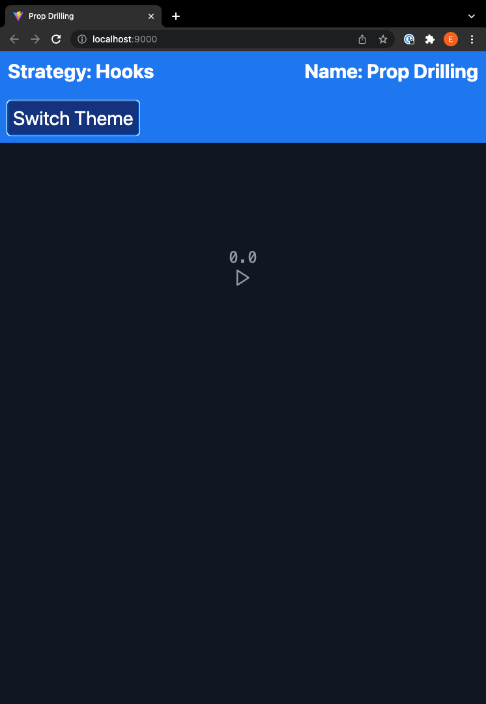
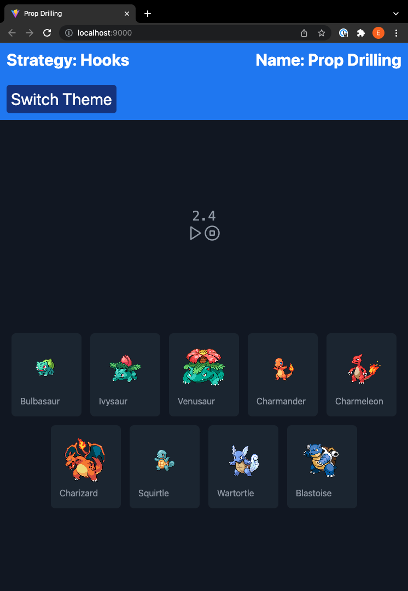

# Picking the correct type of state management solution

Idea written: January 11, 2022 12:42 PM
Language: English
Last Update: February 18, 2022 4:22 PM
Release Date: February 18, 2022 4:23 PM
Released: Yes
Summary: There are a lot of situations that we need to decide what is the best state manager for our app
Tags: Frontend, State management
Type: Article

# Introduction

One of the most frequent questions I have to ask myself is which state management solution should I use?

Over the past week, I've done a lot of research building 22 separate little applications, all of which implement the same thing but with different state management styles, including 20 other state managers. If you can believe that, there will be all of the code during this exercise of this research that has helped me understand the different state managers, how they all relate together, and what kind of generic models they are implementing. With these, we can figure out which category is the right one for you; all right, let's jump directly into working through that mental model.

The foundation of our mental model is react hooks, the basics are use-state and user-reducer to create state and then use-memo use-effect and use-callback to monitor that state. As I researched, there aren't many state managers supporting the class-based state system; there are a few, but absolutely 100% across the board, all of them are doing hooks. That has to be the foundation for you; the better you understand how to use react hooks effectively, the better that you will use these state management solutions.

# The Application

Let's go and take a look at our application, and then we'll go into our prop drilling example, which will be essentially the starting point of all this okay, so here's our application it's a stopwatch application.

I can start and stop that stopwatch, and then once that stopwatch value goes across two seconds, it makes a fetch call that seems a little bit arbitrary; this helps demonstrate three critical properties of state management. The first one is just getting and setting fundamental state values, and that's been shown most by this start button; it just toggles a boolean. The second is asynchronous work here and how state managers manage asynchronous workflows; it is crucial because we do much async work in javascript. The third aspect is around connections between data. This stopwatch demonstrates this case; when the count goes over two seconds, it prompts this JSON fetch over here, allowing us to explore how the different state managers will enable you to connect business logic and look at values and things like that.

I did want to have an example that showed those three key aspects: setting & getting values asynchronous stuff and then connections between values in the same model. I created examples that were this small and simple because I want you to go and take the code, take all of my state out of it, put your new into it, and see how that model works. Let's go over and see how I built it using the fundamentals, built into react, no state manager at all.

We are in the examples directory under hooks prop drilling and then in source under `app.tsx`, every one of these will have an `app.tsx` file; it's essentially the same between each of the applications and then a `store.tsx` file that contains whatever the store business logic is.f

# Strategies

## Prop drilling

Prop drilling is the most basic of them all and the fastest to get out of control. If we use two or three levels of deep data, we should be thinking about using a different solution because this will only lead to problems down the line, making the components more coupled together than we want.

### Pros

- Built into React
- Easier to work with a small scale app

### Cons

- Horrible scalability

## State manager with Finite State Machines (FSM)

**State charts** are a formalism for modeling stateful, reactive systems. This is useful for describing your application's behavior, from the individual components to the overall application logic.

### Pros

- There is no way we can get to an impossible state.
- We could use a visualizer to get a graphic idea of how it works and anticipate issues beforehand

### Cons

- It is not suited for all of the applications because it makes it more complex to handle it.

### Js libraries

- Xstate

## API+  State Management

This term doesn't exist by itself, but this could be like a data-management library. Instead of managing the data in how we store it, we let the library decide for us and do revalidation, prefetching, smart error retry, optimistic UI changes, data dependency, etc.

### Pros

- The data of the app becomes simple to access.
- These types of solutions reduce the app's complexity by using custom hooks per endpoint hit.

### Cons

- If mishandled, it may be more pressure on the server and database
- If there is no code cleanliness there could be business logic polluting a lot the UI and making it impossible to use

### Js libraries

- Redux toolkit Query
- React Query
- SWR

Are with the use of graphql

- Urql
- Apollo-Client

## State Management with Context

This state management solution is good for slow-moving data, aka. user, theme. Data that moves slowly, this is because with Context, if you are not memorizing the state the whole tree will re-render, and as the app grows you'll need to change the state management to something faster.

### Pros

- Built into React
- No extra bundle size
- Easier to grasp

### Cons

- There is much to know and you would be building a state management solution for fast-moving data
- More code needs to be written

### Js libraries

- React

## Reactive State Management

This is the best suited for event-based apps, basically a pub-sub model. that is strongly used with Rxjs. If the team has very strong Angular skills I would use this as an option.

### Pros

- Event-based systems make it easier to manage complex async work
- There is no care if there are 0 subscribers of ∞ number of subscribers because it is a fire and forget solution.

### Cons

- You need to have a greater mental model of what's going on to see everything in time.

### Js libraries

- Rxjs
- Akita
- Storeon

## Atomic State Management

> Atoms are units of state. They're updateable and subscribable: when an atom is updated, each subscribed component is re-rendered with the new value. → RecoilJS
> 

This kind of state management solution gives a loose coupling similar of a react state management but instead of subscribing to events you are subscribing to the state of that specific atom.

### Pros

- Loose coupling event system

### Cons

- It is really powerful but at the same time you don't really need the performance, we could use it in some parts of the app where the performance is key, but not to go ham with it.

### Js libraries

- Recoil
- Jotai

## Uni-Directional State Management

This means that all of the data flows directionally from 1 direction. Redux is the biggest one here, and this means that all of the data comes from the store and it can only be changed by redux, and not by react itself

### Pros

- A single source of truth
- The data is easier to store

### Cons

- With some libraries there is a lot of boilerplate code
- It can grow without control
- You have the temptation of

### Js libraries

- Zustand
- Redux with Redux Toolkit
- Unistore

## Bi-Directional State Management

### Pros

- Less boiler plate code
- The view is able to automatically modify the controller

### Cons

- For thin apps with little business logic bi-directional state management solutions would be the best ones out there because of speed
- You may introduce bugs in the way of how the data is displaying itself

### Js libraries

- MobX
- Valtio
- MobX State Tree
- React Easy State

# Is Your State Really Global?

[https://kroki.io/excalidraw/svg/eNrVm1lX4soWx9_7U7i8j-eYU_PQb6KgOIAKgnruXa6QBAiEBDMw2Ku_-60EWwISRdFuwoMuqirJrqr_rl_tXeHHt52d3XA6tHa_7-xaE0N3bNPXx7t_x-Ujyw9sz1VVKPkeeJFvJC27YTgMvv_zz_wKzfAGs6ssxxpYbhiodv-q7zs7P5K_qef4lhHqbsexkguSqvmjMIfLpRXPTR4LCWGIS0zZcws7OFTPCy1TVbd1J7DmNXHR7sH1_r51VKxUxXnlKLqtIKfW9OePbduOUwunTmKW4XtBsNfVQ6M7bxGEvte3mrYZdmMLlsqfrw08NQzzq3wv6nRdKwh-jV1S6g11ww6n8X0AeC6djcT3nXnJRH0jCGicUYboc3FyoYQaEhKky2emHHiO58em_Ackn7kxLd3od5RFrjlvY1gmMfV5m_GvDiImNEIxTN2_a9mdbhhXMqkxZToDgGJOybxngZXMAAIAI8kwk8818YOHZXOuhqT0vN5uVgUYOmelQlCpDg7qD3W8-1T_v-VB7ur-8Gkwd4P4S6pvcbeKKcXNL46Gpj4TBmSEAoxR_H9us2O7fVXpRo6TFP38e7VaQ2sSrhIqASJLqAIQIQAjZG2dVg6LrdFRlXd7I7t52Qsf5N3NaYZOu7rRjXzrT2iUaBwiLIQUAAuSmuZEskBJVgrJmFKooAIuKBdRqHHBiERKXVIgspGAQ193g6Huq2lfIWIoNI4QQIIoKykBK7RMhAYxoBQBJhnB9IWWBUSSipQb5ELJc8V4blizH-NJw0KjgBACGaUcEoEXGpX0ge1MF3STKF5ZeOR4Ld1Jz0NgqWcl9yRZwxdfvO_YHTdZUlVnLH_Be0JbIeO5QeilhsBQ5ujq_n7ZXO6O59sd29Wd-qJprzruq5ghkGdiBkqiupVy77e896bjnV0O7-4aNRGOBudmYzKAIMeUwYJqGACOOMUYUrkZa9o6RRR9NmuUe3IsCaL8DQ89Pj_FD7e1YID9mvk4jibuI-7mjTWcZKmVqDrl0-tviZx2R45YZzT2zMPSyT45qj7wKG-oQURTLEEEYUQYl4vyJQhqkqu1iRIJsMTij5JGMg0xCAGBWCLBAXmhZK56wBGBNF9K_lTWXFm6Ef7XfQU5AmWN4-9BzqKFG5CHyEzyqKVYKtXD9b25cmAf126jm-bIFa53fTbueeNqjtFDOdcwAZgzoUYivcf-CHoIMADln44eiAAnavMD33DYGrzoVf3ReVR_7Bl7h912IXTLOUOPWkaz5IqAAGqBhRytLddRsB85PcM07zttfuccdJoD8zJ38OGaCnQxj1dtBOWCfhkk8TKFKRNAhTtAfiF7iEaIEqhaZ5UxhH2IPYgLAeNYJ19SXoc95J3sOfOM7UbPzMCPkwenHHU5Y6HWW6aiHrC2J7dk4BX6F7Xy6YPNTuyxbprTrIzFkkf-KeRQITVE8WL2bBbvcE3pRfnS1yTVlDIZA3ABds8-iinQpBBIpGH0yz0BVhEOgRK_lYY4fiDXpdu-0z11Cnq907of3jRyRhqcSgm9IA3CWK1T68vz5KpnEjo8K5bR-RFu0xqrnLjbJs9XMUNVjAMElou6TPZIhGqEC7ooqM9ULErZkhLqC3kKGW-TBJFbK0-8Lj2QeF9abCcI1eN2up7XD1ZCIzU1vzMntmDXBlEKzmYF4AwQwdbPj91xy2igBoruW_e-KPuF60P7crtZweM4hMVIRDT2I7gEDLXXQBxvITKoYoaaHfxWbNIcdo7rN2iPFLlsNPYmtf3QGn25SyKYZtnGabFskTKktmoQiPWPYAb3j41iISxOCo-weikjm14ElVwRg6ntfpyOT4jxQrOUMKVZ-IX7HJwy-DVqxFtoZQ3JmUQ3o0bJdm21Ls9W53MV2qpFfUvAsdq0DdjBM89WpNrQMIbg-hmDScmrWke9dpEPD1l33GrXxhd8u9khWbI_k1nsoNpWkgMSoFwTI_lWHvq2E43OaNs6mKL960owEJ5108sbOrjIPv_DHHLG3nGmMokqXdEc7dWOTy1-5Vy4Jw_tfLFDSqEJIgBhYiU7sMbRV0Ycqbd-XkEHAhQTDlUf8iXRzdCxf1H-aztIkVjycTBQkn3oziWQknGyfohPrloWPjamBy69mLD-hd68qjS2mwwQE6hxsCIFBdXeDSxXbAcXlKqBmhnwptNdDSNyctW7LV2UsNMeW-WmYdZzxgXKsiUqKSFQArB-TMEqDacNjurO5XTfosfexYMomrniAsSQamqYV6ShMCUaoUK-GVB8ULASrYMELDGilMKciXMzIly79p5px2ut0mfGocVvh8OyUR_nBAOZr7swStUixuU7Tsib0I6GsDTgfF8HYK92RaPmlmOCIqkJOMs-vXj_l0gG5DaeVUjKOUdvvsYiUS0k8tx37nvH_PK8_ciL5ZOcYYKhbEwgTJEaCbF-fnT4ICaF0k2rEoTHATqBlci_RfnCBAVSY4SRFZggUkkWoC8Mefl6pxUcSyYpQDkT6GaoKGwhKQqfBQpKM0EhlFaZFGh9LyyeRXvTUeQZo3HdnQrjcnq8195yUECKNSrhKlBgjfyhYEKFeZqES7VPTqj20FSusV0r306bU3LSb_VrV6Whdc3PZF_PWyyBsnNMEgrEMUfv-IkIswYlIyD1K-eu1WgbJ7ekVM0XJCAXGnlxBDGdvRSpCQbx0s7iEyUr1mIER5gp1UKcL3lumF8KvYFtbEmGaWbLzN--PY3lrj4c1uLTCdVi5n1qWmzzqaPz--2ObGtcWPUThOQT3zXx4dhZrHi0f_z89vPb_wG0IDxf](https://kroki.io/excalidraw/svg/eNrVm1lX4soWx9_7U7i8j-eYU_PQb6KgOIAKgnruXa6QBAiEBDMw2Ku_-60EWwISRdFuwoMuqirJrqr_rl_tXeHHt52d3XA6tHa_7-xaE0N3bNPXx7t_x-Ujyw9sz1VVKPkeeJFvJC27YTgMvv_zz_wKzfAGs6ssxxpYbhiodv-q7zs7P5K_qef4lhHqbsexkguSqvmjMIfLpRXPTR4LCWGIS0zZcws7OFTPCy1TVbd1J7DmNXHR7sH1_r51VKxUxXnlKLqtIKfW9OePbduOUwunTmKW4XtBsNfVQ6M7bxGEvte3mrYZdmMLlsqfrw08NQzzq3wv6nRdKwh-jV1S6g11ww6n8X0AeC6djcT3nXnJRH0jCGicUYboc3FyoYQaEhKky2emHHiO58em_Ackn7kxLd3od5RFrjlvY1gmMfV5m_GvDiImNEIxTN2_a9mdbhhXMqkxZToDgGJOybxngZXMAAIAI8kwk8818YOHZXOuhqT0vN5uVgUYOmelQlCpDg7qD3W8-1T_v-VB7ur-8Gkwd4P4S6pvcbeKKcXNL46Gpj4TBmSEAoxR_H9us2O7fVXpRo6TFP38e7VaQ2sSrhIqASJLqAIQIQAjZG2dVg6LrdFRlXd7I7t52Qsf5N3NaYZOu7rRjXzrT2iUaBwiLIQUAAuSmuZEskBJVgrJmFKooAIuKBdRqHHBiERKXVIgspGAQ193g6Huq2lfIWIoNI4QQIIoKykBK7RMhAYxoBQBJhnB9IWWBUSSipQb5ELJc8V4blizH-NJw0KjgBACGaUcEoEXGpX0ge1MF3STKF5ZeOR4Ld1Jz0NgqWcl9yRZwxdfvO_YHTdZUlVnLH_Be0JbIeO5QeilhsBQ5ujq_n7ZXO6O59sd29Wd-qJprzruq5ghkGdiBkqiupVy77e896bjnV0O7-4aNRGOBudmYzKAIMeUwYJqGACOOMUYUrkZa9o6RRR9NmuUe3IsCaL8DQ89Pj_FD7e1YID9mvk4jibuI-7mjTWcZKmVqDrl0-tviZx2R45YZzT2zMPSyT45qj7wKG-oQURTLEEEYUQYl4vyJQhqkqu1iRIJsMTij5JGMg0xCAGBWCLBAXmhZK56wBGBNF9K_lTWXFm6Ef7XfQU5AmWN4-9BzqKFG5CHyEzyqKVYKtXD9b25cmAf126jm-bIFa53fTbueeNqjtFDOdcwAZgzoUYivcf-CHoIMADln44eiAAnavMD33DYGrzoVf3ReVR_7Bl7h912IXTLOUOPWkaz5IqAAGqBhRytLddRsB85PcM07zttfuccdJoD8zJ38OGaCnQxj1dtBOWCfhkk8TKFKRNAhTtAfiF7iEaIEqhaZ5UxhH2IPYgLAeNYJ19SXoc95J3sOfOM7UbPzMCPkwenHHU5Y6HWW6aiHrC2J7dk4BX6F7Xy6YPNTuyxbprTrIzFkkf-KeRQITVE8WL2bBbvcE3pRfnS1yTVlDIZA3ABds8-iinQpBBIpGH0yz0BVhEOgRK_lYY4fiDXpdu-0z11Cnq907of3jRyRhqcSgm9IA3CWK1T68vz5KpnEjo8K5bR-RFu0xqrnLjbJs9XMUNVjAMElou6TPZIhGqEC7ooqM9ULErZkhLqC3kKGW-TBJFbK0-8Lj2QeF9abCcI1eN2up7XD1ZCIzU1vzMntmDXBlEKzmYF4AwQwdbPj91xy2igBoruW_e-KPuF60P7crtZweM4hMVIRDT2I7gEDLXXQBxvITKoYoaaHfxWbNIcdo7rN2iPFLlsNPYmtf3QGn25SyKYZtnGabFskTKktmoQiPWPYAb3j41iISxOCo-weikjm14ElVwRg6ntfpyOT4jxQrOUMKVZ-IX7HJwy-DVqxFtoZQ3JmUQ3o0bJdm21Ls9W53MV2qpFfUvAsdq0DdjBM89WpNrQMIbg-hmDScmrWke9dpEPD1l33GrXxhd8u9khWbI_k1nsoNpWkgMSoFwTI_lWHvq2E43OaNs6mKL960owEJ5108sbOrjIPv_DHHLG3nGmMokqXdEc7dWOTy1-5Vy4Jw_tfLFDSqEJIgBhYiU7sMbRV0Ycqbd-XkEHAhQTDlUf8iXRzdCxf1H-aztIkVjycTBQkn3oziWQknGyfohPrloWPjamBy69mLD-hd68qjS2mwwQE6hxsCIFBdXeDSxXbAcXlKqBmhnwptNdDSNyctW7LV2UsNMeW-WmYdZzxgXKsiUqKSFQArB-TMEqDacNjurO5XTfosfexYMomrniAsSQamqYV6ShMCUaoUK-GVB8ULASrYMELDGilMKciXMzIly79p5px2ut0mfGocVvh8OyUR_nBAOZr7swStUixuU7Tsib0I6GsDTgfF8HYK92RaPmlmOCIqkJOMs-vXj_l0gG5DaeVUjKOUdvvsYiUS0k8tx37nvH_PK8_ciL5ZOcYYKhbEwgTJEaCbF-fnT4ICaF0k2rEoTHATqBlci_RfnCBAVSY4SRFZggUkkWoC8Mefl6pxUcSyYpQDkT6GaoKGwhKQqfBQpKM0EhlFaZFGh9LyyeRXvTUeQZo3HdnQrjcnq8195yUECKNSrhKlBgjfyhYEKFeZqES7VPTqj20FSusV0r306bU3LSb_VrV6Whdc3PZF_PWyyBsnNMEgrEMUfv-IkIswYlIyD1K-eu1WgbJ7ekVM0XJCAXGnlxBDGdvRSpCQbx0s7iEyUr1mIER5gp1UKcL3lumF8KvYFtbEmGaWbLzN--PY3lrj4c1uLTCdVi5n1qWmzzqaPz--2ObGtcWPUThOQT3zXx4dhZrHi0f_z89vPb_wG0IDxf)

## Separating Business Logic

If we have complex business logic, we would like to separate the business logic into its npm module to be testable. You don't want to get business logic tied up too much in code into react because what if you want to go to a server or change the framework. You would save so much time by just separating that on the go.

## What Would I Use?

We'll start with what I would use professionally now. I have to add on the concerns of who will do the work and the ecosystem around the libraries. It tends to skew my decisions a bit more traditional, so, in this case, I would strongly prefer to do an API+  model where I'm just using react location, react-query, and keep it very, very simple. I would externalize the business logic if there were exciting business logic that I would want to reuse in different contexts when it comes to having a global state manager. I'd probably still queue towards redux, using redux toolkit, again because of the number of available people to work on that and the unidirectional simple data model and all the tooling around that. If i want to go with a bidirectional model, mobx is also an excellent contender here and still has a fantastic support community.
